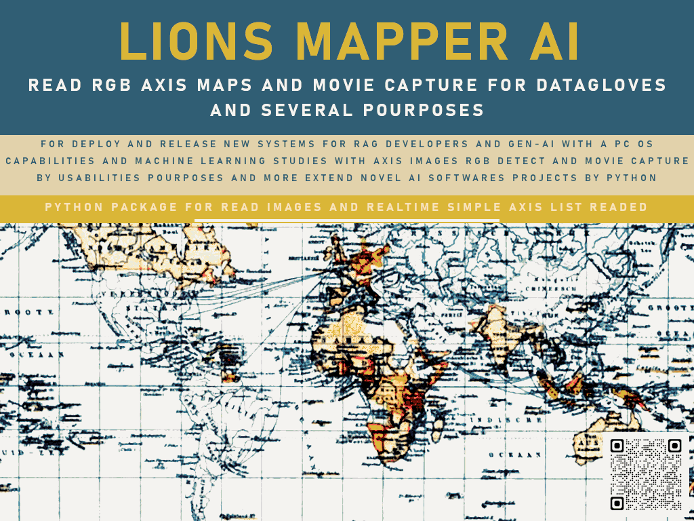

# LIONS MAPPER AI

Python package designed to detect Cartesian coordinates (X and Y) within RGB tone search filters to capture movements using webcam input and image analysis.  



## Overview
**LIONS MAPPER AI** is a Python package designed to detect Cartesian coordinates (X and Y) within RGB tone search filters.  
It is an initial version derived from the old **PYAISPINLINE** and aims to capture movements using webcam input and image analysis.  

This project is also intended to integrate with upcoming launches such as:
- **AIRDRUMS_LIONS_V1** – for drum duelists to rapidly project their drum set.
- **DATA_GLOVER_V1** – to integrate DATA_GLOVER with virtual keyboards, movement tracking, and mouse clicks.  
  This module also includes a special feature to launch a virtual keyboard, which will soon become part of the **RADGRAM** project for plotting portable instruments in images and enabling a “conductor mode” across multiple instruments via Motion Capture.

Future planned modules include:
- **AirPiano** – for piano key and color detection.
- **AirGuitar** – for guitar string and color detection.

This project is part of investigation into new Artificial Intelligence technologies, with RAG, LLMs, and Machine Learning support via **WebDiver** ([github.com/ssmool/webdiver](https://github.com/ssmool/webdiver)), at studying maps, images, and films for new GEN-AI purposes and beyond.

---

## Manual
A complete usage manual is available at:

[LIONS MAPPER AI COMPLETE_MANUAL](./manual/README.MD)


## Installation
Install via pip:

```bash
pip install lionsmapper
````

## Quick Usage Examples

### Example 1: Detect Cartesian Coordinates from RGB Filter

```python
from lionsmapper import *

# Detect coordinates in a map image based on an RGB color filter
_get_spin_route("map.png", (255, 255, 255))  # image_source: map.png, RGB: 255,255,255

# Get coordinates as tuples per axis line
_axis = _get_axis_line(0)
print(str(_axis))
```


## Available Modules

```python
from lionsmapper import lionmapper_webcam_capture
from lionsmapper import lions_map_axis
from lionsmapper import lions_map_mv_detect
from lionsmapper import mapper_webcam_capture
```

## Project Goals

For now, **LIONS MAPPER AI** seeks to:

* Support the evolution of GEN-AI and RAG systems.
* Extend concepts into fields such as robotics, multimedia, game theory, software design, visual arts, photography, and music.
* Provide integration with systems like **DATA_GLOVE_V1**.
* Enable hardware attachment for PC joystick enthusiasts through a dedicated motion-tracking glove.

---

## Development Status

This is an **in-development** project.
Developed by **#asytrick**
📧 Contact: **[eusmool@gmail.com](mailto:eusmool@gmail.com)**

```

---

If you want, I can also **add a “Roadmap” section** to make the README more complete and future-focused.  
Do you want me to include that next?
```
