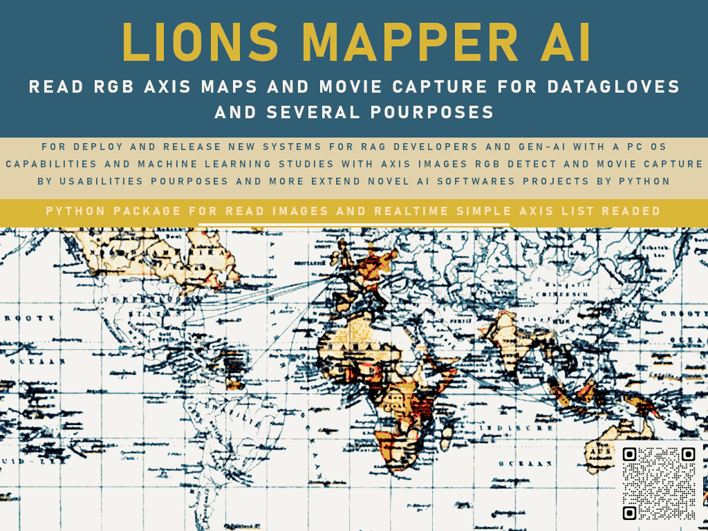

# LIONSMAPPER AI



**LIONSMAPPER AI** is a Python package for detecting Cartesian coordinates (X, Y) from RGB color filters in images, videos, or real-time webcam streams.  
This project is an early evolution of the former **PYAISPINLINE** and focuses on image mapping, movement detection, and axis tracking for RGB-based research workflows.

## 📦 Modules Overview

### 1. `lionmapper_webcam_capture`
Functions for webcam usage and frame acquisition for RGB mapping.

- **`start_webcam(video_source=0, max_frame_rate=12)`**  
  Starts a real-time webcam viewer.  
  - `video_source`: Camera index or video file path.  
  - `max_frame_rate`: Maximum FPS to display.

- **`get_frame()`**  
  Returns the last captured frame when called.

---

### 2. `lions_map_mv_detect`
Movement capture and workflow image mapping utilities.

- **`update_map_src(file)`**  
  Updates the source file for tracing.

- **`get_lab_map()`**  
  Retrieves the map history plotted.

- **`append_map_rgb(map_name, rgb)`**  
  Adds a new RGB task to the lab map list.  
  Example: `append_map_rgb("full_spinline_map", (255, 255, 255))`

- **`get_move(map_rgb)`**  
  Starts movement capture using the given RGB color.

- **`get_axis()`**  
  Gets the last detected axis coordinates.

---

### 3. `mapper_webcam_capture`
Webcam recording management.

- **`file_save(file_name='FILE.MP4')`**  
  Sets the output file name for saving webcam recordings.

- **`file_saved()`**  
  Returns the file path that is used by the webcam viewer.

---

### 4. `lions_map_axis`
Axis detection and movement tracking for image/video sources.

- **`get_move(_img_src, color_rgb, _update=0)`**  
  Detects movement in the given `_img_src` (image or video).  
  Set `_update=1` for continuous stream reading (e.g., from a webcam).

- **`get_axis()`**  
  Returns the axis detected in the pipeline while reading the source.

- **`get_move_update(time, _img_src, color_rgb)`**  
  Updates movement detection over a specified `time` interval.  
  Use `time=-1` for continuous updates.

---

## 🚀 Installation

```bash
pip install lionsmapperai_v1
````

---

## 🔧 Example Usage

```python
from lionsmapperai import lionmapper_webcam_capture as lwc
from lionsmapperai import lions_map_mv_detect as lmd

# Start webcam
lwc.start_webcam(video_source=0, max_frame_rate=12)

# Get the latest frame
frame = lwc.get_frame()

# Set map source
lmd.update_map_src("path/to/image.jpg")

# Append an RGB mapping task
lmd.append_map_rgb("full_spinline_map", (255, 255, 255))

# Detect movement
lmd.get_move((255, 255, 255))
coords = lmd.get_axis()
print("Detected Axis:", coords)
```

🔧 Example Usage

```python
from lionsmapperai import lionmapper_webcam_capture as lwc
from lionsmapperai import lions_map_mv_detect as lmd

# Start webcam
lwc.start_webcam(video_source=0, max_frame_rate=12)

# Get the latest frame
frame = lwc.get_frame()

# Set map source
lmd.update_map_src("path/to/image.jpg")

# Append an RGB mapping task
lmd.append_map_rgb("full_spinline_map", (255, 255, 255))

# Detect movement
lmd.get_move((255, 255, 255))
coords = lmd.get_axis()
print("Detected Axis:", coords)
```

🔍 Features & Workflow Diagram
Below is the typical LIONSMAPPER AI workflow from real-time video/image input to axis coordinate detection:

     ┌─────────────────────────┐
     │  Webcam / Video Source  │
     └──────────┬──────────────┘
                │ start_webcam()
                ▼
     ┌─────────────────────────┐
     │ Frame Capture (get_frame)│
     └──────────┬──────────────┘
                │ update_map_src()
                ▼
     ┌─────────────────────────┐
     │ RGB Map Task (append_map_rgb)│
     └──────────┬──────────────┘
                │ get_move()
                ▼
     ┌─────────────────────────┐
     │ Movement Detection      │
     └──────────┬──────────────┘
                │ get_axis()
                ▼
     ┌─────────────────────────┐
     │ Axis Coordinates Output │
     └─────────────────────────┘

## 📄 License

This project is licensed under the Creative Commons Zero V1 – see the [LICENSE](LICENSE) file for details.

